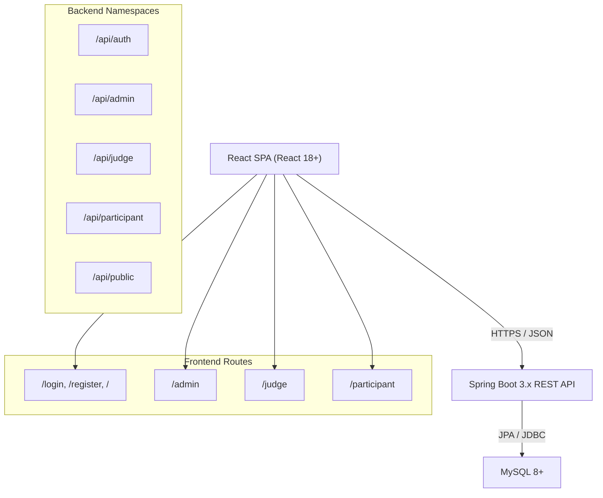
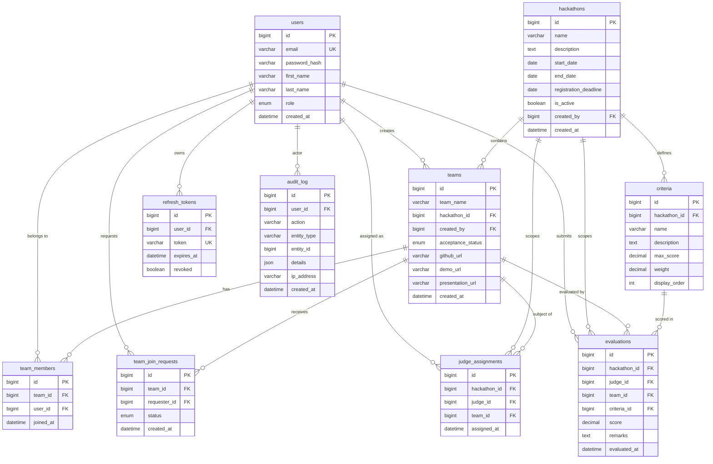

# Design Document: VerdictSphere

## Overview

VerdictSphere is a full-stack hackathon evaluation platform supporting three user roles — Admin, Judge, and Participant — with role-specific dashboards, weighted scoring, real-time leaderboards, and immutable audit logging.

The system is a decoupled architecture: a Spring Boot 3.x REST API backend and a React 18+ single-page application frontend, backed by MySQL 8+. Authentication is stateless via JWT (15-minute access tokens) + long-lived Refresh Tokens. All significant mutations are recorded in an append-only audit log.

### Key Design Goals

- Role isolation: each role has a dedicated API namespace and frontend route, enforced at the Spring Security layer
- Correctness of scoring: weighted score computation is deterministic and centralized in the Evaluation Engine
- Auditability: every create/update/delete on core entities writes an immutable audit log entry
- Simplicity of onboarding: Admins are pre-seeded; Judges are created by Admins; Participants self-register

---

## Architecture



### Request Lifecycle

1. React sends request with `Authorization: Bearer <JWT>` header
2. Spring Security `JwtAuthFilter` validates the token and populates `SecurityContext`
3. Method-level or URL-pattern security enforces role checks
4. Service layer executes business logic, writes audit log entries as needed
5. Response returned as JSON (or CSV for export)

### Token Strategy

- Access JWT: 15-minute expiry, signed with HS256, contains `userId`, `email`, `role`
- Refresh Token: stored in the `refresh_tokens` table (or as a secure HttpOnly cookie), long-lived (7 days)
- On 401 from any protected endpoint, the React Axios interceptor calls `POST /api/auth/refresh-token` and retries

---

## Components and Interfaces

### Backend Components

#### AuthService
Handles registration, login, JWT issuance, and token refresh.

```
POST /api/auth/register     → RegisterRequest  → UserResponse
POST /api/auth/login        → LoginRequest     → AuthResponse (jwt + refreshToken)
POST /api/auth/refresh-token → RefreshRequest  → AuthResponse
```

#### UserManager (Admin)
Admin-only CRUD for Judge accounts and user listing.

```
POST   /api/admin/judges        → CreateJudgeRequest → UserResponse
GET    /api/admin/judges        →                    → List<UserResponse>
DELETE /api/admin/judges/{id}   →                    → 204
GET    /api/admin/users         →                    → List<UserResponse>
```

#### HackathonManager (Admin)
Full CRUD for hackathons.

```
POST   /api/admin/hackathons        → HackathonRequest  → HackathonResponse
GET    /api/admin/hackathons        →                   → List<HackathonResponse>
PUT    /api/admin/hackathons/{id}   → HackathonRequest  → HackathonResponse
DELETE /api/admin/hackathons/{id}   →                   → 204
GET    /api/public/active-hackathons →                  → List<HackathonResponse>
```

#### CriteriaManager (Admin)
CRUD for scoring criteria per hackathon.

```
POST   /api/admin/criteria        → CriteriaRequest  → CriteriaResponse
PUT    /api/admin/criteria/{id}   → CriteriaRequest  → CriteriaResponse
DELETE /api/admin/criteria/{id}   →                  → 204
```

#### TeamService (Participant + Public)
Team creation, join requests, member management, project submission.

```
POST /api/participant/team                              → TeamRequest         → TeamResponse
GET  /api/public/teams/{hackathonId}                   →                     → List<TeamSummary>
POST /api/participant/team/join                        → JoinRequest         → JoinRequestResponse
GET  /api/participant/team/join-requests               →                     → List<JoinRequestResponse>
PUT  /api/participant/team/join-requests/{id}/accept   →                     → 200
PUT  /api/participant/team/join-requests/{id}/reject   →                     → 200
DELETE /api/participant/team/members/{userId}          →                     → 204
PUT  /api/participant/team/submission                  → SubmissionRequest   → TeamResponse
```

#### TeamAcceptanceService (Admin + Judge)
Accept/reject teams for evaluation eligibility.

```
PUT /api/admin/teams/{id}/accept   → 200
PUT /api/admin/teams/{id}/reject   → 200
PUT /api/judge/teams/{id}/accept   → 200
PUT /api/judge/teams/{id}/reject   → 200
GET /api/admin/teams               → List<TeamDetailResponse>
GET /api/judge/teams               → List<TeamDetailResponse>
```

#### JudgeAssignmentService (Admin)
Distribute teams to judges and manage assignments.

```
POST /api/admin/judge-assignments/auto/{hackathonId}  → 200
POST /api/admin/judge-assignments                     → AssignmentRequest → AssignmentResponse
GET  /api/admin/judge-assignments/{hackathonId}       → List<AssignmentResponse>
GET  /api/judge/assignments                           → List<TeamResponse>
```

#### EvaluationEngine (Judge)
Score submission, update, and retrieval.

```
POST /api/judge/evaluations        → EvaluationRequest  → EvaluationResponse
PUT  /api/judge/evaluations/{id}   → EvaluationRequest  → EvaluationResponse
GET  /api/judge/evaluations        →                    → List<EvaluationResponse>
```

#### LeaderboardService (Public + Judge + Participant)
Compute and serve ranked results.

```
GET /api/public/leaderboard/{hackathonId}  → List<LeaderboardEntry>
GET /api/judge/leaderboard                 → List<LeaderboardEntry>
GET /api/participant/leaderboard           → List<LeaderboardEntry>
GET /api/participant/scores                → TeamScoreResponse
```

#### AnalyticsService (Admin)
Completion summaries and CSV export.

```
GET /api/admin/analytics/{hackathonId}  → AnalyticsSummary
GET /api/admin/export/{hackathonId}     → CSV file (Content-Type: text/csv)
```

#### AuditService
Append-only audit log recording and retrieval.

```
GET /api/admin/audit-logs  → Page<AuditLogEntry>  (filters: userId, action, dateFrom, dateTo)
```

### Frontend Components

#### Routing (React Router v6)

| Route | Component | Guard |
|---|---|---|
| `/` | LandingPage | Public |
| `/login` | LoginPage | Public |
| `/register` | RegisterPage | Public |
| `/admin` | AdminDashboard | ADMIN only |
| `/judge` | JudgeDashboard | JUDGE only |
| `/participant` | ParticipantDashboard | PARTICIPANT only |

Route guards are implemented as `<ProtectedRoute role="ADMIN">` wrapper components that read role from AuthContext and redirect to `/login` if unauthorized.

#### AuthContext
Global React context providing `{ user, jwt, login, logout, refreshToken }`. The Axios instance reads the JWT from context and the response interceptor handles 401 → refresh → retry.

#### Admin Dashboard Tabs
`Overview | Hackathons | Judges | Users | Criteria | Teams | Evaluations | Results | Audit`

#### Judge Dashboard Tabs
`Team Acceptance | Assigned Teams | Evaluation Form | My Evaluations | Leaderboard`

#### Participant Dashboard Tabs
`Team Browser | Join Requests (lead only) | Team Profile | Members | Project Submission | My Scores | Leaderboard`

---

## Data Models

### Entity Relationship Diagram



### Key Java DTOs / Entities

**RegisterRequest**: `email`, `password`, `firstName`, `lastName`

**LoginRequest**: `email`, `password`

**AuthResponse**: `jwt`, `refreshToken`, `role`, `userId`

**TeamSummary** (public listing): `id`, `teamName`, `memberCount`, `maxCapacity(4)`, `hackathonId`

**EvaluationRequest**: `teamId`, `hackathonId`, `scores: List<CriteriaScore>` where `CriteriaScore = { criteriaId, score, remarks }`

**LeaderboardEntry**: `rank`, `teamId`, `teamName`, `weightedScore`, `innovationScore`, `judgeCount`

**AuditLogEntry**: `id`, `userId`, `action`, `entityType`, `entityId`, `details`, `ipAddress`, `createdAt`

### Weighted Score Formula

```
WeightedScore(team) =
  [ Σ_judges ( Σ_criteria (score_jc × weight_c) / Σ_criteria (maxScore_c × weight_c) × 100 ) ]
  / judgeCount
```

Tie-breaking: when two teams share the same `WeightedScore` (rounded to 4 decimal places), the team with the higher raw score on the criterion named "Innovation" (case-insensitive match) ranks first.

### DataInitializer

On application startup, a `DataInitializer` bean checks whether the 3 admin accounts exist (by email) and inserts them if not, using BCrypt-hashed passwords from `application.properties` (or environment variables). This ensures idempotent seeding.


---

## Correctness Properties

*A property is a characteristic or behavior that should hold true across all valid executions of a system — essentially, a formal statement about what the system should do. Properties serve as the bridge between human-readable specifications and machine-verifiable correctness guarantees.*

### Property 1: Registration always produces PARTICIPANT role with BCrypt hash

*For any* valid registration request (unique email, non-empty password), the resulting user stored in the database SHALL have `role = PARTICIPANT` and a `password_hash` that is a valid BCrypt-encoded string (starts with `$2a$` or `$2b$`).

**Validates: Requirements 1.1, 1.8**

---

### Property 2: Duplicate email registration returns 409

*For any* email address already present in the `users` table, a subsequent registration attempt with that same email SHALL return HTTP 409 Conflict, and no new user record SHALL be created.

**Validates: Requirements 1.3, 2.2**

---

### Property 3: Login returns JWT and Refresh Token for valid credentials

*For any* user with a known email and password, a login request with those credentials SHALL return a response containing a non-null `jwt` field and a non-null `refreshToken` field, and the JWT's expiry claim SHALL be approximately 15 minutes from issuance (within a 5-second tolerance).

**Validates: Requirements 1.4**

---

### Property 4: Refresh token round-trip produces a new valid JWT

*For any* valid, non-expired refresh token issued to a user, submitting it to `POST /api/auth/refresh-token` SHALL return a new JWT with a 15-minute expiry. The original refresh token SHALL remain valid until its own expiry or explicit revocation.

**Validates: Requirements 1.5**

---

### Property 5: Invalid or expired tokens return 401

*For any* string that is not a currently valid refresh token (expired, never issued, or already revoked), submitting it to `POST /api/auth/refresh-token` SHALL return HTTP 401. Similarly, *for any* request to a protected endpoint with a missing, malformed, or expired JWT, the response SHALL be HTTP 401.

**Validates: Requirements 1.6, 12.5**

---

### Property 6: Invalid login credentials return uniform 401

*For any* login attempt where either the email does not exist or the password does not match, the response SHALL be HTTP 401 and the error message SHALL be identical regardless of which field is incorrect (no field-level disclosure).

**Validates: Requirements 1.7**

---

### Property 7: Judge creation produces JUDGE role and audit entry

*For any* valid judge creation request submitted by an Admin, the resulting user SHALL have `role = JUDGE`, and an `audit_log` entry SHALL exist recording the actor's `user_id`, action `CREATE_JUDGE`, entity type `USER`, and the new judge's `entity_id`.

**Validates: Requirements 2.1**

---

### Property 8: Judge list reflects all created judges

*For any* set of N judges created via `POST /api/admin/judges`, the response from `GET /api/admin/judges` SHALL contain exactly those N judges (plus any pre-existing judges), with no omissions or duplicates.

**Validates: Requirements 2.3**

---

### Property 9: Judge deletion removes account and records audit entry

*For any* existing judge, after a successful `DELETE /api/admin/judges/{id}`, the judge SHALL NOT appear in `GET /api/admin/judges`, and an `audit_log` entry SHALL exist for the deletion action.

**Validates: Requirements 2.4**

---

### Property 10: Hackathon CRUD round-trip preserves all fields

*For any* valid hackathon creation payload, the hackathon returned by `GET /api/admin/hackathons` SHALL contain all submitted fields unchanged. After a `PUT` update with a new payload, the retrieved hackathon SHALL reflect the updated values. After a `DELETE`, the hackathon SHALL no longer appear in the list.

**Validates: Requirements 3.1, 3.2, 3.3, 3.4**

---

### Property 11: Public active-hackathons endpoint returns only active hackathons

*For any* set of hackathons in the database, `GET /api/public/active-hackathons` SHALL return only those with `is_active = true`, and SHALL NOT return any hackathon with `is_active = false`.

**Validates: Requirements 3.5**

---

### Property 12: Hackathon with end date before start date is rejected

*For any* hackathon creation or update request where `end_date < start_date`, the system SHALL return HTTP 400 Bad Request and SHALL NOT persist the hackathon.

**Validates: Requirements 3.6**

---

### Property 13: Criteria weight validation rejects out-of-range values

*For any* criteria creation request where `weight <= 0` or `weight > 100`, the system SHALL return HTTP 400 Bad Request and SHALL NOT persist the criteria.

**Validates: Requirements 4.5**

---

### Property 14: Hackathon activation requires criteria weights summing to 100

*For any* hackathon whose criteria weights do not sum to exactly 100, an attempt to activate that hackathon SHALL return HTTP 400 Bad Request.

**Validates: Requirements 4.4**

---

### Property 15: Team creation sets creator as sole member with PENDING status

*For any* valid team creation request by a Participant, the resulting team SHALL have exactly 1 member (the creator), the creator SHALL be flagged as the Team Lead, and `acceptance_status` SHALL be `PENDING`.

**Validates: Requirements 5.1, 5a.1**

---

### Property 16: Public team listing reflects accurate member counts

*For any* hackathon with N teams, `GET /api/public/teams/{hackathonId}` SHALL return all N teams, each with a `memberCount` equal to the actual number of entries in `team_members` for that team, and `maxCapacity = 4`.

**Validates: Requirements 5.2, 5.9 (member count accuracy)**

---

### Property 17: Join request creates PENDING request without adding member

*For any* join request submitted by a Participant to a team with fewer than 4 members, the system SHALL create a `team_join_requests` record with `status = PENDING`, and the team's `memberCount` SHALL remain unchanged.

**Validates: Requirements 5.3**

---

### Property 18: Accepting a join request adds member and updates status

*For any* PENDING join request, when the Team Lead accepts it, the requester SHALL appear in the team's member list, the join request `status` SHALL be `ACCEPTED`, and the team's `memberCount` SHALL increase by 1.

**Validates: Requirements 5.4**

---

### Property 19: Rejecting a join request does not add member

*For any* PENDING join request, when the Team Lead rejects it, the requester SHALL NOT appear in the team's member list, the join request `status` SHALL be `REJECTED`, and the team's `memberCount` SHALL remain unchanged.

**Validates: Requirements 5.5**

---

### Property 20: Full team rejects new join requests with 409

*For any* team with exactly 4 members, any new join request submission SHALL return HTTP 409 Conflict with the message "Team is full", and no new join request record SHALL be created.

**Validates: Requirements 5.7**

---

### Property 21: Participant cannot be on two teams in the same hackathon

*For any* Participant already on a team in hackathon H, any attempt to create a new team or submit a join request for another team in hackathon H SHALL return HTTP 409 Conflict.

**Validates: Requirements 5.8**

---

### Property 22: Duplicate join request returns 409

*For any* Participant with an existing PENDING join request for team T, submitting another join request for team T SHALL return HTTP 409 Conflict, and no duplicate record SHALL be created.

**Validates: Requirements 5.9**

---

### Property 23: Project submission persists all URLs

*For any* valid project submission with a GitHub URL, demo URL, and presentation URL, the team record SHALL reflect all three URLs after the `PUT /api/participant/team/submission` call.

**Validates: Requirements 5.11**

---

### Property 24: Invalid URL format in submission returns 400

*For any* submission where the GitHub URL or demo URL does not match a valid URL pattern (must start with `http://` or `https://`), the system SHALL return HTTP 400 Bad Request and SHALL NOT update the team record.

**Validates: Requirements 5.12**

---

### Property 25: Team acceptance/rejection sets correct status and records audit entry

*For any* team, when an Admin or Judge submits an accept request, the team's `acceptance_status` SHALL become `ACCEPTED` and an audit log entry SHALL be recorded. When an Admin or Judge submits a reject request, the `acceptance_status` SHALL become `REJECTED` and an audit log entry SHALL be recorded.

**Validates: Requirements 5a.3, 5a.4, 5a.5, 5a.6**

---

### Property 26: PENDING teams block evaluation submission with 403

*For any* team with `acceptance_status = PENDING`, any evaluation submission attempt by a Judge SHALL return HTTP 403 Forbidden.

**Validates: Requirements 5a.2, 7.7**

---

### Property 27: Auto-assignment distributes teams within bounds

*For any* hackathon with J judges and T accepted teams (where T >= J), after triggering auto-assignment, every judge SHALL have between 5 and 10 assigned teams, and every accepted team SHALL be assigned to at least one judge.

**Validates: Requirements 6.1**

---

### Property 28: Duplicate judge assignment returns 409

*For any* existing (judge, team) assignment pair, attempting to create a duplicate assignment SHALL return HTTP 409 Conflict, and no duplicate record SHALL be created.

**Validates: Requirements 6.4**

---

### Property 29: Evaluation submission persists scores and remarks

*For any* valid evaluation submission by a Judge for an assigned, ACCEPTED team, the scores and remarks for each criterion SHALL be retrievable via `GET /api/judge/evaluations` and SHALL match the submitted values.

**Validates: Requirements 7.2, 7.8**

---

### Property 30: Score bounds validation rejects out-of-range scores

*For any* evaluation submission where any criterion score is less than 0 or greater than the criterion's `max_score`, the system SHALL return HTTP 400 Bad Request and SHALL NOT persist any part of the evaluation.

**Validates: Requirements 7.4, 7.5**

---

### Property 31: Judge cannot evaluate unassigned teams

*For any* (judge, team) pair where no `judge_assignments` record exists, an evaluation submission attempt SHALL return HTTP 403 Forbidden.

**Validates: Requirements 7.6**

---

### Property 32: Weighted score formula is computed correctly

*For any* team with evaluations from one or more judges across one or more criteria, the computed `WeightedScore` SHALL equal `[ Σ_judges ( Σ_criteria (score_jc × weight_c) / Σ_criteria (maxScore_c × weight_c) × 100 ) ] / judgeCount`, with no rounding error beyond 4 decimal places.

**Validates: Requirements 8.1**

---

### Property 33: Leaderboard is sorted descending by weighted score with innovation tie-break

*For any* hackathon with evaluated teams, the leaderboard returned SHALL be sorted in descending order of `WeightedScore`. When two teams share the same `WeightedScore` (to 4 decimal places), the team with the higher raw score on the criterion named "Innovation" (case-insensitive) SHALL rank first.

**Validates: Requirements 8.2, 8.3**

---

### Property 34: Participant scores endpoint returns only own team's data during active hackathon

*For any* in-progress hackathon, `GET /api/participant/scores` for a given Participant SHALL return only that Participant's team scores and SHALL NOT include any other team's scores or evaluation data.

**Validates: Requirements 9.2**

---

### Property 35: Audit log captures all mutations with required fields

*For any* create, update, or delete operation on a Hackathon, Criteria, Team, Evaluation, or User entity, an `audit_log` entry SHALL be created containing: a non-null `user_id`, a non-null `action` string, a non-null `entity_type`, a non-null `entity_id`, and a UTC `created_at` timestamp.

**Validates: Requirements 11.1, 11.2**

---

### Property 36: Role-based namespace enforcement

*For any* request to `/api/admin/**` by a non-ADMIN user, the response SHALL be HTTP 403. *For any* request to `/api/judge/**` by a non-JUDGE user, the response SHALL be HTTP 403. *For any* request to `/api/participant/**` by a non-PARTICIPANT user, the response SHALL be HTTP 403.

**Validates: Requirements 12.1, 12.2, 12.3**

---

### Property 37: Public endpoints are accessible without authentication

*For any* request to `/api/public/**`, `/api/auth/register`, or `/api/auth/login` made without an `Authorization` header, the response SHALL NOT be HTTP 401 or HTTP 403.

**Validates: Requirements 12.4**

---

### Property 38: Audit log filter correctness

*For any* set of audit log entries, filtering by `userId` SHALL return only entries with that `user_id`; filtering by `action` SHALL return only entries with that action type; filtering by `dateFrom`/`dateTo` SHALL return only entries with `created_at` within the specified range. Combining filters SHALL return the intersection.

**Validates: Requirements 10.3**

---

### Property 39: CSV export contains all required fields for all teams

*For any* hackathon with evaluated teams, the CSV returned by `GET /api/admin/export/{hackathonId}` SHALL contain one row per team, and each row SHALL include: team name, weighted score, per-criteria scores, and final rank.

**Validates: Requirements 10.2**

---

### Property 40: Token refresh interceptor retries original request

*For any* API request that fails with HTTP 401 due to an expired JWT, the frontend Axios interceptor SHALL automatically call `POST /api/auth/refresh-token`, obtain a new JWT, and retry the original request exactly once with the new token.

**Validates: Requirements 13.5**

---

## Error Handling

### Backend Error Response Format

All API errors return a consistent JSON envelope:

```json
{
  "timestamp": "2024-01-15T10:30:00Z",
  "status": 400,
  "error": "Bad Request",
  "message": "End date must be after start date",
  "path": "/api/admin/hackathons"
}
```

A global `@RestControllerAdvice` (`GlobalExceptionHandler`) maps exceptions to HTTP responses:

| Exception | HTTP Status | Notes |
|---|---|---|
| `EmailAlreadyExistsException` | 409 Conflict | Registration and judge creation |
| `InvalidCredentialsException` | 401 Unauthorized | Generic message, no field disclosure |
| `InvalidTokenException` | 401 Unauthorized | Expired or malformed JWT/refresh token |
| `AccessDeniedException` | 403 Forbidden | Spring Security default |
| `TeamFullException` | 409 Conflict | "Team is full" |
| `DuplicateMembershipException` | 409 Conflict | Already on a team in this hackathon |
| `DuplicateJoinRequestException` | 409 Conflict | Pending request already exists |
| `DuplicateAssignmentException` | 409 Conflict | Judge already assigned to team |
| `TeamNotAcceptedException` | 403 Forbidden | "Team has not been accepted for evaluation." |
| `ScoreOutOfRangeException` | 400 Bad Request | Score < 0 or > max_score |
| `InvalidUrlException` | 400 Bad Request | Malformed GitHub/demo URL |
| `InvalidDateRangeException` | 400 Bad Request | end_date < start_date |
| `WeightOutOfRangeException` | 400 Bad Request | weight <= 0 or > 100 |
| `WeightSumException` | 400 Bad Request | Criteria weights don't sum to 100 |
| `UnauthorizedAssignmentException` | 403 Forbidden | Judge evaluating unassigned team |
| `EntityNotFoundException` | 404 Not Found | Any entity not found by ID |
| `MethodArgumentNotValidException` | 400 Bad Request | Bean Validation failures |

### Frontend Error Handling

- Axios response interceptor handles 401 → refresh → retry (one attempt only; if refresh also fails, redirect to `/login`)
- All API error messages are surfaced to the user via a toast notification component
- Form validation errors (from React Hook Form + Yup) are shown inline below each field
- Network errors (no response) show a generic "Network error, please try again" message

---

## Testing Strategy

### Dual Testing Approach

Both unit/integration tests and property-based tests are required. They are complementary:
- Unit/integration tests verify specific examples, edge cases, and integration points
- Property-based tests verify universal correctness across many generated inputs

### Backend Testing

**Framework**: JUnit 5 + Spring Boot Test + Mockito

**Integration tests** (Spring `@SpringBootTest` with H2 or Testcontainers MySQL):
- One integration test per API endpoint covering the happy path and key error cases
- Focus on: auth flows, role enforcement, team lifecycle, evaluation submission, leaderboard computation

**Property-based testing framework**: [jqwik](https://jqwik.net/) (Java property-based testing library)

Each property test MUST:
- Run a minimum of 100 tries (`@Property(tries = 100)`)
- Be tagged with a comment referencing the design property:
  `// Feature: verdict-sphere, Property N: <property_text>`
- Use `@Provide` arbitraries to generate valid domain objects

Example property test structure:

```java
// Feature: verdict-sphere, Property 32: Weighted score formula is computed correctly
@Property(tries = 100)
void weightedScoreFormulaIsCorrect(
    @ForAll @Size(min = 1, max = 5) List<@Positive Double> scores,
    @ForAll @Size(min = 1, max = 5) List<@Positive Double> weights,
    @ForAll @Size(min = 1, max = 5) List<@Positive Double> maxScores
) {
    // arrange: build evaluation data from generated inputs
    // act: call EvaluationEngine.computeWeightedScore(...)
    // assert: result matches manual formula computation
}
```

**Key property tests to implement** (one test per property):

| Property | Test Focus |
|---|---|
| P1 | Registration → role=PARTICIPANT, BCrypt hash |
| P2 | Duplicate email → 409 |
| P3 | Login → JWT with 15-min expiry |
| P4 | Refresh token round-trip |
| P5 | Invalid token → 401 |
| P6 | Invalid login → uniform 401 message |
| P15 | Team creation → 1 member, PENDING status |
| P17 | Join request → PENDING, no member added |
| P18 | Accept join request → member added |
| P20 | Full team → 409 |
| P21 | Duplicate hackathon membership → 409 |
| P26 | PENDING team blocks evaluation → 403 |
| P30 | Score bounds → 400 |
| P32 | Weighted score formula correctness |
| P33 | Leaderboard ordering + tie-break |
| P35 | Audit log fields completeness |
| P36 | Role namespace enforcement |
| P37 | Public endpoints accessible without auth |
| P38 | Audit log filter correctness |

### Frontend Testing

**Framework**: Jest + React Testing Library

**Unit tests** (examples and edge cases):
- `AuthContext`: login stores JWT and role, logout clears state
- `ProtectedRoute`: redirects non-matching roles to `/login`
- `EvaluationForm`: renders one input per criterion, validates score bounds
- `TeamBrowser`: displays member count as "N/4"
- `RegisterPage`: form does not contain a role selection field (Property 37 / Req 13.3)

**Property-based testing framework**: [fast-check](https://fast-check.io/) (TypeScript/JavaScript)

Each property test MUST:
- Run a minimum of 100 samples (`fc.assert(fc.property(...), { numRuns: 100 })`)
- Be tagged with a comment: `// Feature: verdict-sphere, Property N: <property_text>`

Key frontend property tests:

```typescript
// Feature: verdict-sphere, Property 40: Token refresh interceptor retries original request
it('retries original request after token refresh', () => {
  fc.assert(fc.property(
    fc.string(), // any API path
    (path) => {
      // mock 401 response, then successful refresh, then successful retry
      // assert: original request was retried with new token
    }
  ), { numRuns: 100 });
});
```

```typescript
// Feature: verdict-sphere, Property 33: Leaderboard sorted descending
it('leaderboard entries are sorted by weighted score descending', () => {
  fc.assert(fc.property(
    fc.array(fc.record({ teamName: fc.string(), weightedScore: fc.float() }), { minLength: 2 }),
    (teams) => {
      const sorted = sortLeaderboard(teams);
      for (let i = 0; i < sorted.length - 1; i++) {
        expect(sorted[i].weightedScore).toBeGreaterThanOrEqual(sorted[i + 1].weightedScore);
      }
    }
  ), { numRuns: 100 });
});
```

### Test Configuration Summary

| Layer | Framework | Min Iterations | Tag Format |
|---|---|---|---|
| Backend PBT | jqwik | 100 (`@Property(tries=100)`) | `// Feature: verdict-sphere, Property N: ...` |
| Frontend PBT | fast-check | 100 (`numRuns: 100`) | `// Feature: verdict-sphere, Property N: ...` |
| Backend integration | JUnit 5 + Spring Boot Test | N/A (example-based) | Standard JUnit annotations |
| Frontend unit | Jest + RTL | N/A (example-based) | Standard Jest `it()`/`test()` |
